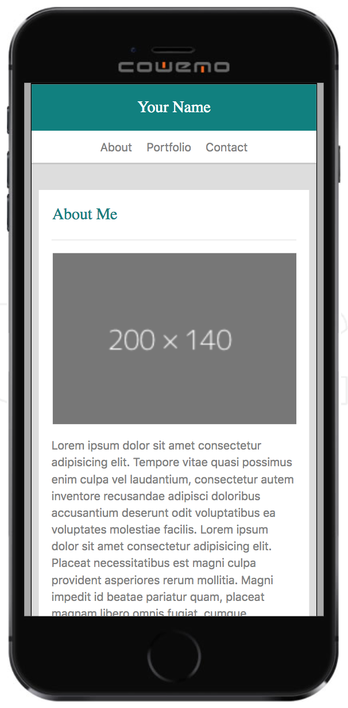
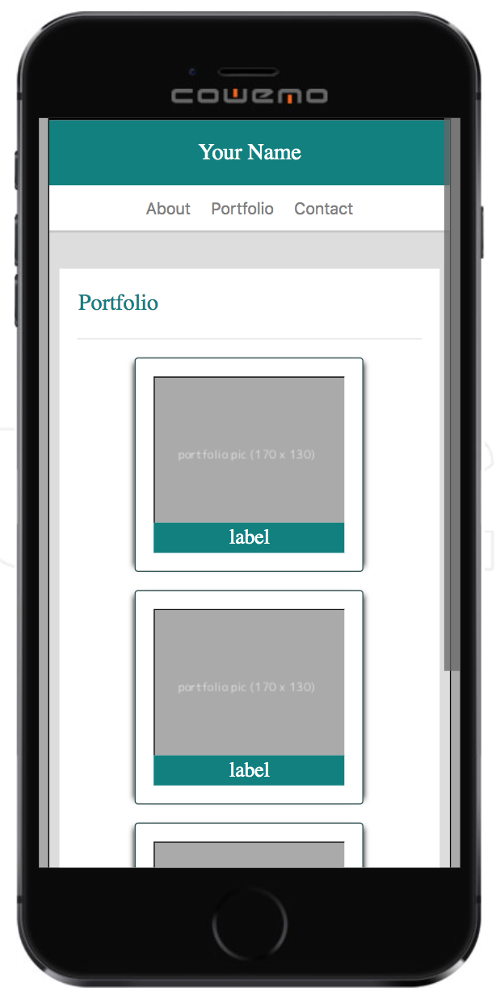
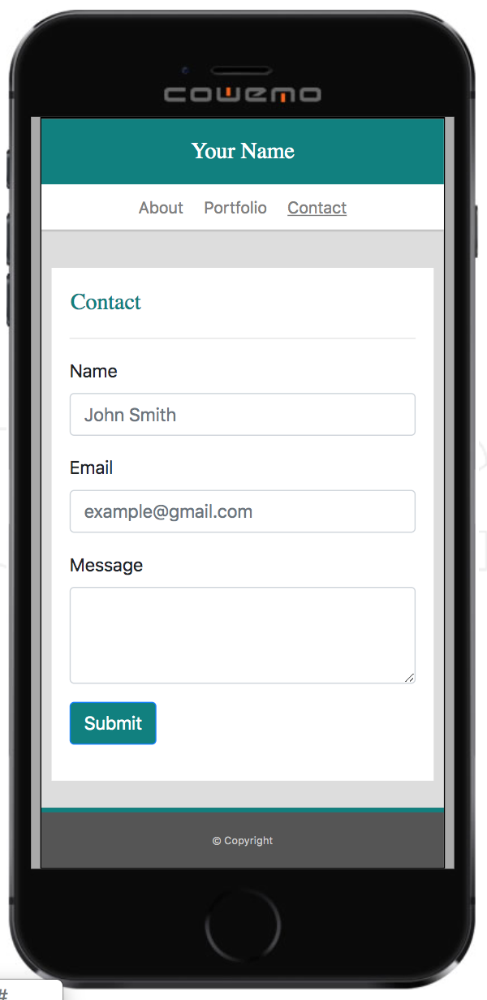
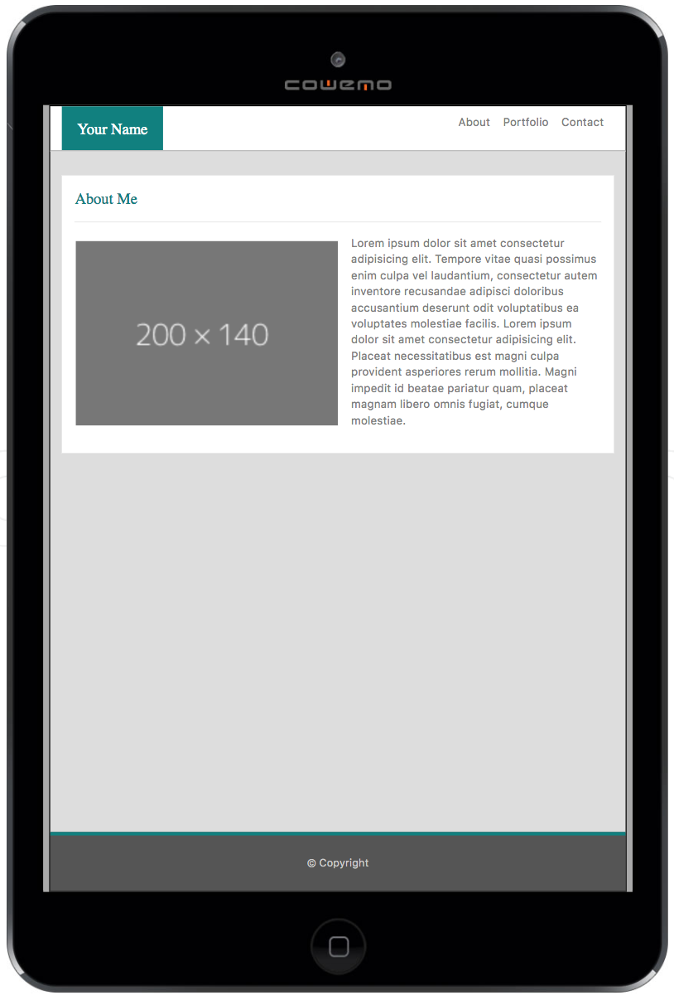
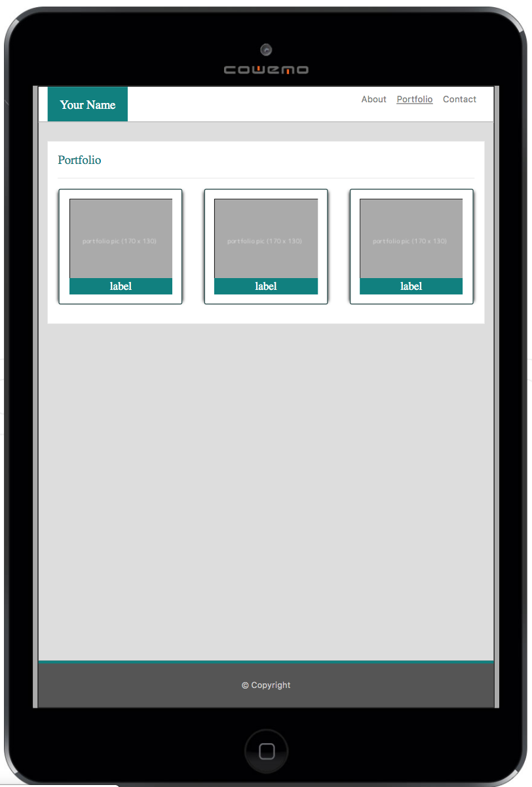
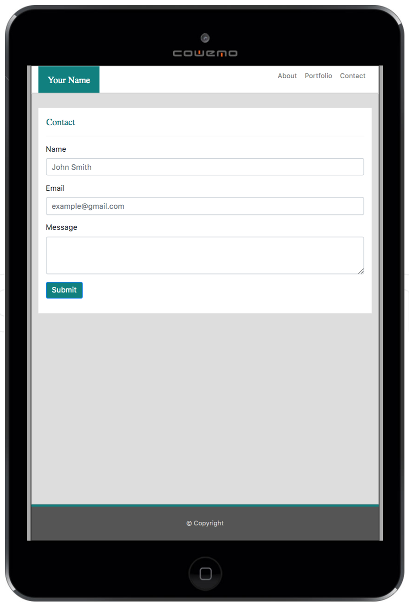

# utbc2019-hw-02-portfolio

## Overview

This week, we build a responsive, bootstrap-based, portfolio template for documenting
intersting stuff we've done.

## Specification

The full problem assignment can be found [here](https://github.com/the-Coding-Boot-Camp-at-UT/UTAUS201902FSF5/blob/master/02-css-bootstrap/02-Homework/Instructions/homework-instructions.md).

## Demo Day!

The hosted solution resides [here](https://zenglenn42.github.io/utbc2019-hw-02-portfolio).
The 'Contact' page includes an email submission form.  However, since we're only dealing with front-end HTML and CSS at this stage in the curriculum, the form is not live.

## Attribution

I've borrowed some ideas from Lea Verou's CSS Secrets book for sticky footers and intrinsic sizing of portfolio items scetched out [here](http://dabblet.com/gist/410e43c60863a8dba193) and [here](http://dabblet.com/gist/82eb1575806f6eff9c37).

## Emulator Screen-Shots

On phones, the layout looks like this:

On tablets and desktops, it looks more like this:

